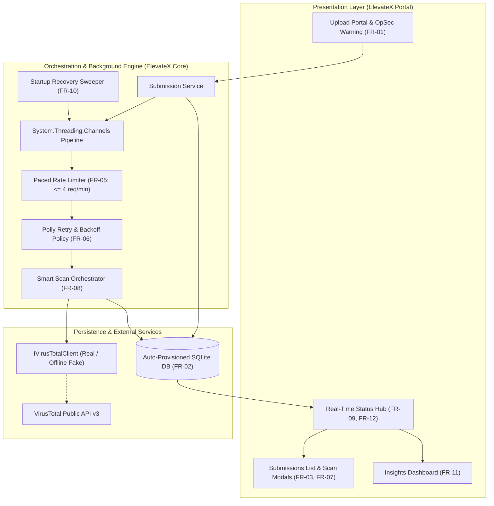

# Comprehensive Technical & Non-Technical Implementation Plan
**Project:** Suspicious File Submission & VirusTotal Analysis Portal (.NET / C#)  
**Specification:** ElevateX Software Development Technical Assessment v2.0

---

## 1. Master Requirements Traceability Matrix

| ID | Priority | Description | Phase Addressed | Explicit Decision Gate? |
| :--- | :---: | :--- | :---: | :---: |
| **FR-01** | **MUST** | File upload + metadata (Source, Reason for suspicion, extended domain fields) | Phase 2, 5 | No |
| **FR-02** | **MUST** | Local persistence, restart survival, first-run self-provisioning (`dotnet run`) | Phase 2 | **Yes (Gate 2: Persistence Store)** |
| **FR-03** | **MUST** | Submissions list table with SHA-256, filename, date, status, scan summary | Phase 5 | No |
| **FR-04** | **MUST** | Asynchronous background processing (non-blocking UI upload/browsing) | Phase 4 | **Yes (Gate 4: Queue Architecture)** |
| **FR-05** | **MUST** | Rate-limit compliance ($\le 4$ API requests/min; 20-file burst queues cleanly & drains paced) | Phase 4 | No |
| **FR-06** | **MUST** | Failure handling with exponential backoff on 429/timeouts/5xx; bounded retries $\rightarrow$ `Failed` | Phase 4 | No |
| **FR-07** | **MUST** | Results display: detection ratio (flagged/total), verdict summary, link to full VT report | Phase 5 | No |
| **FR-08** | **SHOULD** | Duplicate awareness: SHA-256 already processed links to existing analysis (0 extra quota) | Phase 3 | **Yes (Gate 3: Quota Strategy)** |
| **FR-09** | **SHOULD** | Live status updates in UI without manual refresh | Phase 5 | No |
| **FR-10** | **SHOULD** | Restart resilience: Queued and in-progress items survive restart and resume processing | Phase 4 | No |
| **FR-11** | **SHOULD** | Insights dashboard: Submissions over time, detection rates, status breakdown, top sources | Phase 6 | No |
| **FR-12** | **COULD** | SignalR push updates, `.xlsx` export, Serilog logging, strategy for files $>32$ MB | Phase 5, 6, 7 | No |
| **VT-01** | **MUST** | Test high-value logic: rate-limited dispatch, retry/backoff, state machine, deduplication | Phase 7 | No |
| **VT-02** | **MUST** | Isolate external dependency: `IVirusTotalClient` faked/stubbed; runs 100% offline | Phase 3, 7 | No |
| **VT-03** | **MUST** | Declare testing boundaries in `DECISIONS.md` (what was deliberately omitted & why) | Phase 7 | **Yes (Gate 5: Testing Boundaries)** |
| **VT-04** | **SHOULD** | End-to-end integration test: Upload $\rightarrow$ Background Scan Pipeline $\rightarrow$ DB $\rightarrow$ `Completed` | Phase 7 | No |
| **D-01** | **MUST** | Public GitHub repository or clean downloadable ZIP archive | Phase 8 | No |
| **D-02** | **MUST** | `README.md`: Setup instructions, API key guide, test commands, assumptions, band 🎸 | Phase 8 | No |
| **D-03** | **MUST** | `DECISIONS.md`: 10–15 bullets (user-logged at each decision gate) | Phase 1–8 | No (Direct user prompt) |
| **D-04** | **SHOULD** | Clean, incremental commit history reflecting logical progression | All Phases | No |

---

## 2. System Architecture & Component Design



---

## 3. Phased Execution Roadmap & Explicit Decision Gates

```mermaid
flowchart LR
    P1["Phase 1: Setup & Scaffolding<br/><b>Gate 1: UI Stack</b>"] --> P2["Phase 2: Domain & Persistence<br/><b>Gate 2: Storage Engine</b>"]
    P2 --> P3["Phase 3: VT Client & Pipeline<br/><b>Gate 3: Quota Strategy</b>"]
    P3 --> P4["Phase 4: Worker Engine<br/><b>Gate 4: Queue Architecture</b>"]
    P4 --> P5["Phase 5: Submissions Portal & UI"]
    P5 --> P6["Phase 6: Insights Dashboard"]
    P6 --> P7["Phase 7: Offline Test Suite<br/><b>Gate 5: Test Boundaries</b>"]
    P7 --> P8["Phase 8: Deliverables & Polish"]
```



---

### Phase 1: Project Scaffolding & Setup
* **Objective:** Establish the .NET solution structure, project boundaries, and configuration baseline.

> [!NOTE]
> ### 🛑 Decision Gate 1: Presentation & UI Framework (§7)
> 
> * **Option A (Recommended): ASP.NET Core Blazor Server (Interactive)**
>   * **Implementation Plan:** Create a Blazor Server project in `src/ElevateX.Portal`. Use Razor components with `@rendermode InteractiveServer`. Inject backend services directly into components. State updates push automatically over the persistent SignalR circuit.
>   * **Pros:** Built-in real-time two-way UI sync (FR-09); single unified C# codebase across frontend and backend; no npm/Node.js or frontend build tooling.
>   * **Cons:** Holds UI circuit state in server memory; requires active WebSocket connection.
> 
> * **Option B: ASP.NET Core Razor Pages / MVC + Minimal JS (Alpine.js / HTMX)**
>   * **Implementation Plan:** Create a Razor Pages project. Use standard HTML forms with anti-forgery tokens for uploads. Use Alpine.js or HTMX with `hx-get="/api/submissions"` polling to update the table without full page reloads.
>   * **Pros:** Lightweight, stateless server model, fast initial load, simple request-response lifecycle.
>   * **Cons:** Requires writing client-side polling scripts; lacks unified component reactivity without extra JavaScript.
> 
> * **Option C: ASP.NET Core Web API + Standalone SPA (React / Vite)**
>   * **Implementation Plan:** Create an ASP.NET Core Web API project and a separate React/TypeScript frontend inside a `client/` folder. Build React components for upload, submissions list, and charts, communicating via REST API + SignalR client.
>   * **Pros:** Complete frontend/backend decoupling; access to rich React charting ecosystem (e.g. Recharts).
>   * **Cons:** Requires Node.js/npm dependencies, violating the single `dotnet run` simplicity principle and requiring dual-server orchestration.

* **Actionable Steps:**
  1. Initialize Git repository with `.gitignore`.
  2. Create 3-project solution: `src/ElevateX.Portal`, `src/ElevateX.Core`, `tests/ElevateX.Tests`.
  3. Install core dependencies (`Microsoft.EntityFrameworkCore.Sqlite`, `Polly`, `xunit`, `FluentAssertions`, `NSubstitute`).
  4. Setup `appsettings.json` with configuration sections and placeholder keys.
  5. Prompt user with suggested bullet points for `DECISIONS.md` on UI Stack selection.
  6. Commit Phase 1.

---

### Phase 2: Domain Modeling & Local Persistence
* **Objective:** Implement domain entities separating submissions from scan analyses (FR-01, FR-02).

> [!NOTE]
> ### 🛑 Decision Gate 2: Local Persistence Engine (FR-02)
> 
> * **Option A (Recommended): SQLite with Entity Framework Core (EF Core)**
>   * **Implementation Plan:** Add `Microsoft.EntityFrameworkCore.Sqlite`. Create `AppDbContext` defining `FileAnalysis` and `Submission` entities with relational foreign keys and indexes. In `Program.cs`, execute `db.Database.EnsureCreated()` and enable SQLite Write-Ahead Logging (`PRAGMA journal_mode=WAL;`).
>   * **Pros:** Self-provisions the database file on first run (`dotnet run`); full relational model with foreign keys; supports complex LINQ aggregations for dashboard metrics (FR-11).
>   * **Cons:** Potential write contention under heavy concurrent writes (mitigated by WAL mode).
> 
> * **Option B: LiteDB (Embedded NoSQL Document Store)**
>   * **Implementation Plan:** Add `LiteDB` package. Create a singleton `LiteDatabase("elevatex.db")`. Store submissions as document collections with embedded or referenced scan results.
>   * **Pros:** Fast, schema-free BSON storage; stores raw VirusTotal JSON reports natively without object-relational mapping.
>   * **Cons:** Less expressive querying for multi-dimensional statistical metrics (e.g. distinct file grouping across sources).
> 
> * **Option C: File-Backed In-Memory Store with Write-Through JSON Persistence**
>   * **Implementation Plan:** Create a custom thread-safe `ConcurrentDictionary<Guid, FileAnalysis>` backing store. On every write/update, serialize the state to a local `data.json` file using `System.Text.Json`. On startup, load `data.json` into memory.
>   * **Pros:** Zero database library dependencies; instant in-memory lookups.
>   * **Cons:** Brittle crash durability; high disk I/O serializing entire dataset on every mutation; no indexed querying.

* **Actionable Steps:**
  1. Create domain entities: `FileAnalysis` (scan artifact) and `Submission` (analyst event).
  2. Configure `AppDbContext` with indexes and SQLite WAL mode.
  3. Implement automatic startup self-provisioning in `Program.cs`.
  4. Prompt user with suggested bullet points for `DECISIONS.md` on Persistence Store selection.
  5. Commit Phase 2.

---

### Phase 3: VirusTotal Client & Quota-Preserving Scan Pipeline
* **Objective:** Implement the external API client and intelligent scan pipeline (VT-02, FR-08).

> [!NOTE]
> ### 🛑 Decision Gate 3: VirusTotal Quota Strategy (§3 Hint & §6)
> 
> * **Option A (Recommended): "Hash-First Lookup" Two-Phase Pipeline**
>   * **Implementation Plan:** Compute local SHA-256 upon file ingestion. Step 1: Check local DB. Step 2: If not found, call `GET /api/v3/files/{hash}`. If VT has a report, mark `Completed` (1 API call). Step 3: If 404, call `POST /api/v3/files` $\rightarrow$ poll `GET /analyses/{id}` until done (2–3 API calls).
>   * **Pros:** Resolves already-scanned files in **1 API call** with 0 file uploads, saving 50–75% of daily quota (500/day) and reducing queue drainage time by 60%.
>   * **Cons:** Requires a multi-stage state machine (`CheckingHash` $\rightarrow$ `Uploading` $\rightarrow$ `PollingAnalysis`).
> 
> * **Option B: Direct Upload Always (`POST /api/v3/files` + Polling)**
>   * **Implementation Plan:** On every submission, stream file binary directly via `POST /api/v3/files`. Obtain `analysis_id` and poll `GET /api/v3/analyses/{id}` at 15-second intervals until status is `completed`.
>   * **Pros:** Simple, linear pipeline with fewer state transitions.
>   * **Cons:** Always costs 2–3 requests per file even if the file is globally known, exhausting the 4 req/min and 500 req/day quota 2–3× faster.
> 
> * **Option C: Local Deduplication + Hash-Only Mode (Zero-Upload Safe Mode)**
>   * **Implementation Plan:** Calculate SHA-256 locally. Query local DB $\rightarrow$ if miss, call `GET /api/v3/files/{hash}`. If unknown (404), do not upload the binary; instead mark as `Unknown (Upload Suppressed)` to protect sensitive files from entering VT public corpus.
>   * **Pros:** Maximum data privacy (zero binary exposure to VT public corpus); strictly 1 API call per unique file.
>   * **Cons:** Cannot analyze brand-new, unseen malware binaries.

#### Scan Pipeline Decision Flow Matrix
```
+------------------------------------------------------------------------------------+
|                             FILE SUBMISSION INGESTION                              |
|                   (Calculate SHA-256 & Store Local File Stream)                    |
+-----------------------------------------+------------------------------------------+
                                          |
                                          v
                             [Does SHA-256 exist in DB?]
                             /                         \
                  YES (FR-08)                           NO
                          /                               \
               [Is status 'Completed'?]                    v
                     /        \               [Remote VT Hash Lookup]
                  YES          NO             GET /api/v3/files/{sha256}
                  /              \                        |
+----------------------+   +-------------------+    [Report Found?]
| Link new Submission  |   | Attach to in-     |    /             \
| to existing analysis |   | flight analysis   |  YES              NO (404)
| (COST: 0 API calls)  |   | (COST: 0 calls)   |  /                 \
+----------------------+   +-------------------+ v                   v
                             +--------------------+     +----------------------------+
                             | Store scan stats   |     | Upload: POST /api/v3/files |
                             | Status = Completed |     | (COST: 1 Request)          |
                             | (COST: 1 API Call) |     +--------------+-------------+
                             +--------------------+                    |
                                                                       v
                                                        +----------------------------+
                                                        | Poll: GET /analyses/{id}   |
                                                        | (COST: 1-2 Paced Requests) |
                                                        +--------------+-------------+
                                                                       |
                                                                       v
                                                        +----------------------------+
                                                        | Status = Completed         |
                                                        +----------------------------+
```

* **Actionable Steps:**
  1. Define `IVirusTotalClient` interface and implement `VirusTotalClient` using `IHttpClientFactory`.
  2. Create offline `FakeVirusTotalClient` for test isolation.
  3. Implement `ScanPipelineService` executing the selected quota strategy and local deduplication (FR-08).
  4. Handle $>32$ MB files with hash lookup and clear feedback.
  5. Prompt user with suggested bullet points for `DECISIONS.md` on Quota Optimization.
  6. Commit Phase 3.

---

### Phase 4: Rate-Limited Background Engine & Recovery
* **Objective:** Implement non-blocking background scanning, strict 4 req/min throttling, retry backoff, and crash recovery (FR-04, FR-05, FR-06, FR-10).

> [!NOTE]
> ### 🛑 Decision Gate 4: Background Processing & Queue Architecture (FR-04)
> 
> * **Option A (Recommended): `BackgroundService` + `System.Threading.Channels` with Startup DB Recovery**
>   * **Implementation Plan:** Register an in-memory `Channel<Guid>` as a singleton. Web requests push `analysisId` into the channel. A hosted `BackgroundService` consumes items, checks a 15-second timer, and executes the scan pipeline. On application start, a startup sweeper queries the DB for `Queued`/`InProgress` records and re-enqueues them.
>   * **Pros:** Built into .NET 8; non-blocking, zero external dependencies; full crash recovery via database rehydration (FR-10).
>   * **Cons:** In-flight channel state is ephemeral in memory, requiring startup DB scanning.
> 
> * **Option B: Database-Polled Outbox Worker (`BackgroundService` with DB Polling)**
>   * **Implementation Plan:** `SubmissionService` marks records as `Status = Queued` in SQLite. A `BackgroundService` runs a loop every 15 seconds querying `SELECT * FROM FileAnalyses WHERE Status = 'Queued' LIMIT 1`, processes it, and updates the status.
>   * **Pros:** Database is the single persistent queue; zero in-memory channel management; naturally restart-resilient.
>   * **Cons:** Incurs continuous database read polling overhead even when idle.
> 
> * **Option C: Embedded Job Scheduler (Hangfire / Quartz.NET with SQLite Storage)**
>   * **Implementation Plan:** Add `Hangfire.Core` and `Hangfire.Storage.SQLite`. Enqueue jobs via `BackgroundJob.Enqueue(() => ProcessScan(id))`. Configure rate limits using Hangfire retry filters.
>   * **Pros:** Visual web dashboard for job monitoring; built-in persistent retries and failure logging.
>   * **Cons:** Heavy external dependency footprint (multiple extra tables and background threads) for a scoped application.

* **Actionable Steps:**
  1. Implement strict pacing queue enforcing $\ge 15.0$ seconds between outbound API requests ($\le 4$ req/min - FR-05).
  2. Implement `ScanDispatcherBackgroundService` consuming from `Channel<Guid>`.
  3. Implement startup sweeper to recover and re-enqueue in-flight database items upon restart (FR-10).
  4. Configure Polly exponential backoff with max 3 retries $\rightarrow$ `Failed` state with descriptive reason on failure (FR-06).
  5. Prompt user with suggested bullet points for `DECISIONS.md` on Queue Design & Resilience.
  6. Commit Phase 4.

---

### Phase 5: Web UI — Submission Portal, Submissions List & Live Updates
* **Objective:** Build responsive UI components for file uploads, submissions tracking, and scan results (FR-01, FR-03, FR-07, FR-09).
* **Actionable Steps:**
  1. Build layout with sidebar navigation (**Submit Sample**, **Submissions**, **Dashboard**).
  2. Build file upload form with metadata fields (Source, Reason for Suspicion, Priority, Department) and OpSec corpus warning banner (FR-01).
  3. Build Submissions List table with status badges, SHA-256 copy button, detection ratios, and VirusTotal report link modal (FR-03, FR-07).
  4. Implement real-time state synchronization so table rows update dynamically without page refreshes (FR-09).
  5. Add Excel `.xlsx` export button for submission data (FR-12 Stand-out).
  6. Commit Phase 5.

---

### Phase 6: Insights Dashboard & Data Analytics
* **Objective:** Build dashboard answering operational security questions (FR-11).
* **Actionable Steps:**
  1. Implement `AnalyticsService` executing LINQ aggregations (total vs. distinct files, detection rate %, top threat sources, quota tracker).
  2. Build Dashboard component with KPI metric cards, threat trend breakdowns, and date range filters.
  3. Commit Phase 6.

---

### Phase 7: Verification & Automated Test Suite
* **Objective:** Implement 100% offline unit and integration test suite covering high-value logic (VT-01, VT-02, VT-04).

> [!NOTE]
> ### 🛑 Decision Gate 5: Testing Boundaries (VT-03)
> 
> * **Option A (Recommended): High-Value Domain & Resilience Focus**
>   * **Implementation Plan:** Write focused xUnit unit tests for Rate Limiter (15s pacing), Polly retry/backoff on 429/500, State Machine transitions, and SHA-256 deduplication. Add 1 end-to-end integration test via `WebApplicationFactory` with `FakeVirusTotalClient`. Deliberately omit UI markup rendering tests and basic EF CRUD passthroughs, documenting rationale in `DECISIONS.md`.
>   * **Pros:** Fast execution (< 5 seconds); high regression detection on critical code; zero brittle UI tests; strictly complies with VT-01, VT-02, VT-03.
>   * **Cons:** Does not produce 100% line coverage across auto-generated markup/boilerplate.
> 
> * **Option B: Broad Shallow Coverage (Unit Tests for Every Class & Component)**
>   * **Implementation Plan:** Write unit tests for all classes including Blazor components (using bUnit), DTO mappers, DbContext options, and models.
>   * **Pros:** High raw line coverage percentage metrics.
>   * **Cons:** Brittle tests that break on minor HTML tweaks and test boilerplate rather than system behaviors (explicitly discouraged in brief §4).
> 
> * **Option C: Pure Integration-First Test Suite**
>   * **Implementation Plan:** Rely almost exclusively on end-to-end integration tests using `WebApplicationFactory` to simulate full user workflows from HTTP post to DB query, omitting isolated unit tests for individual internal services.
>   * **Pros:** Tests the complete system as a realistic black box.
>   * **Cons:** Slower test runs; difficult to isolate edge cases like mid-flight timer cancellation or specific Polly retry step sequences.

* **Actionable Steps:**
  1. Write unit tests for Rate Limiter, Retry Policy, State Machine, and Deduplication (`ElevateX.Tests/Unit`).
  2. Write end-to-end pipeline integration test (`ElevateX.Tests/Integration`).
  3. Verify all tests run 100% offline in $< 5$ seconds without an API key (VT-02).
  4. Prompt user with suggested bullet points for `DECISIONS.md` on Testing Boundaries (VT-03).
  5. Commit Phase 7.

---

### Phase 8: Deliverables & Polish
* **Objective:** Complete project deliverables, write `README.md`, and perform final verification (D-01, D-02, D-03, D-04).
* **Actionable Steps:**
  1. Write `README.md` containing setup instructions (`dotnet run` zero-config), API key guide (`dotnet user-secrets`), test commands (`dotnet test`), assumptions, and favorite band easter egg 🎸.
  2. Provide user with a final summary checklist to verify their `DECISIONS.md` contains 10–15 punchy bullet points covering all 5 mandatory topics.
  3. Final verification build & test run.
  4. Commit Phase 8.

---

## 4. Verification & Acceptance Checklist

* [ ] `dotnet build` succeeds with 0 errors and 0 warnings.
* [ ] `dotnet test` executes all unit and integration tests offline in $< 5$ seconds with 100% pass rate.
* [ ] `dotnet run` starts the application without manual database setup or SQL scripts.
* [ ] Submitting 10 sample files in rapid succession demonstrates smooth 15-second pacing without exceeding 4 req/min.
* [ ] Resubmitting the same file completes immediately with 0 extra API calls.
* [ ] Killing and restarting the app during in-flight jobs automatically recovers and finishes scanning.
* [ ] `DECISIONS.md` contains 10–15 substantive bullet points covering all 5 mandated topics.
* [ ] `README.md` includes clear setup instructions and the required band selection.
