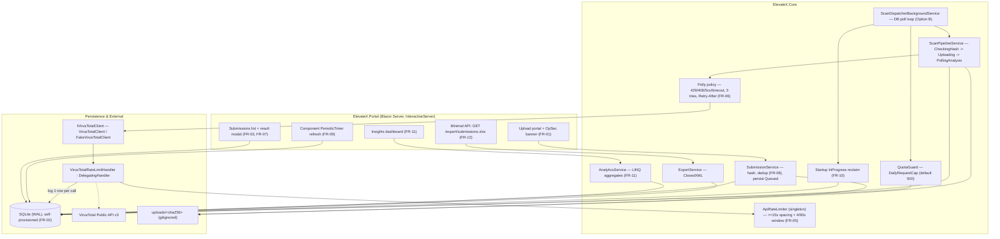

# Implementation Plan v2 — Remaining Work (Phases 4–8)

**Project:** Suspicious File Submission & VirusTotal Analysis Portal (.NET 10 / C#)
**Specification:** ElevateX Software Development Technical Assessment v2.0
**Supersedes:** `docs/implementation_plan.md` (v1) from Phase 4 onward. v1 is kept for provenance; Phases 1–3 of v1 are complete and unchanged.
**Excluded by request:** live working-session (Part C) preparation.
**Hard constraints on this plan:** no commits are made by the assistant (commit messages are supplied in §7); `DECISIONS.md` and `README.md` are **not** edited — suggested content lives in §5 and §6 for the author to apply.

---

## 0. Current State (verified)

| Area | State |
| :--- | :--- |
| Phase 1 — Scaffolding (Gate 1 → Blazor Server) | ✅ committed `85e8102` |
| Phase 2 — Domain & persistence (Gate 2 → SQLite/EF Core, WAL, `EnsureCreated`) | ✅ committed `6ba41d1` |
| Phase 3 — VT client + hash-first pipeline (Gate 3 → Two-phase) | ✅ committed `66a3571` |
| Phase 4 — Background engine | 🟡 ~90%, **uncommitted**; deviates from v1 Gate 4 (see §2) |
| Phase 5 — Submissions portal & UI | 🟡 ~40%, **uncommitted** (upload form + nav only) |
| Phases 6–8 | ❌ not started |
| `dotnet build` | ✅ 0 warnings / 0 errors |

**Uncommitted working tree:**

- `?? src/ElevateX.Core/Services/ScanDispatcherBackgroundService.cs` — DB-polled dispatcher (Option B), 15 s pacing, Polly retry, `Failed` persistence.
- `M src/ElevateX.Portal/Program.cs` — DI wiring for DbContext, typed `HttpClient`, queue, services, hosted service, DB init.
- `M .../Components/Pages/Home.razor` — full upload form, metadata fields, OpSec banner, dedup notice.
- `M .../Components/Layout/NavMenu.razor` — nav links (Submit / Submissions / Dashboard).
- `M .../Components/Layout/MainLayout.razor`, `M .../Components/_Imports.razor` — supporting.
- `?? docs/implementation_plan.md`, and this file.

**Dead code / cruft to remove during Phase 4/5:**

- `src/ElevateX.Core/Services/IScanQueue.cs` + `InMemoryScanQueue.cs` — the `Channel<Guid>` scaffold from v1's Gate 4 Option A. Registered as a singleton and written to by `SubmissionService.SubmitFileAsync` (line ~142), but **never read** by the dispatcher.
- `src/ElevateX.Core/Class1.cs` — `dotnet new classlib` leftover.
- `src/ElevateX.Portal/Components/Pages/Counter.razor`, `Weather.razor` — template pages, no nav entry, still routable.
- `tests/ElevateX.Tests/UnitTest1.cs` — empty stub.

---

## 1. Requirements Traceability — Remaining Work

| ID | Priority | Requirement | Phase | Status entering this plan |
| :--- | :---: | :--- | :---: | :--- |
| FR-01 | MUST | Upload + metadata + OpSec warning | 5 | Done, uncommitted — verify only |
| FR-02 | MUST | Self-provisioning local persistence | 2 | ✅ committed |
| FR-03 | MUST | Submissions list (name, SHA-256, date, status, summary) | 5 | Not started |
| FR-04 | MUST | Async background processing, non-blocking UI | 4 | Done, uncommitted — harden |
| FR-05 | MUST | ≤ 4 API req/min; 20-file burst drains paced | 4 | **Defect — pacing is per-job not per-call (§3, Phase 4, Defect 1)** |
| FR-06 | MUST | Backoff on 429/timeout/5xx; bounded retries → `Failed` | 4 | Done, uncommitted — tighten predicate |
| FR-07 | MUST | Results: flagged/total, summary, VT report link | 5 | Not started (partial on submit-result card) |
| FR-08 | SHOULD | Duplicate awareness links to existing analysis | 3 | ✅ committed (in `SubmissionService`) |
| FR-09 | SHOULD | Live status updates without manual refresh | 5 | Not started |
| FR-10 | SHOULD | Queued + in-progress survive restart & resume | 4 | Partial — **recovery misses mid-hash / mid-upload jobs (§3, Phase 4, Defect 3)** |
| FR-11 | SHOULD | Insights dashboard | 6 | Not started |
| FR-12 | COULD | `.xlsx` export · >32 MB strategy · structured logging · SignalR | 5–8 | >32 MB handled; export/logging pending |
| VT-01 | MUST | Unit-test rate limiter, retry, state machine, dedup | 7 | Not started |
| VT-02 | MUST | `IVirusTotalClient` faked; suite offline, no key, seconds | 7 | Fake exists (`FakeVirusTotalClient`); no tests |
| VT-03 | MUST | Declare testing boundaries in `DECISIONS.md` | 7 | Suggested text in §5 |
| VT-04 | SHOULD | One end-to-end integration test | 7 | Not started |
| D-01 | MUST | Public repo / clean ZIP | 8 | Repo exists |
| D-02 | MUST | `README.md` | 8 | **Missing — content in §6** |
| D-03 | MUST | `DECISIONS.md` 10–15 bullets | all | 3 bullets — **suggestions in §5** |
| D-04 | SHOULD | Clean incremental commit history | all | Drifted — checkpoints in §7 |

---

## 2. Revised Architecture

**Decision Gate 4 is resolved in favour of v1's Option B (Database-Polled Outbox), not the v1-recommended Option A (Channel + sweeper).**

Rationale to record in `DECISIONS.md` (see §5):

- The database is already the durable queue. `FileAnalysis.Status`/`CurrentStage` fully describe outstanding work, so restart resilience (FR-10) needs no second in-memory representation and no separate sweeper component.
- An in-memory `Channel<Guid>` would still require a startup DB scan to rehydrate after a crash — Option A is Option B plus a redundant moving part.
- Polling cost is negligible here: one indexed `WHERE Status IN (...)` query every 2 s on a single-user internal tool.
- Rejected Option C (Hangfire/Quartz): heavy dependency and extra schema for a scoped prototype.

Consequence: **delete** `IScanQueue`, `InMemoryScanQueue`, the `SubmissionService` enqueue call, and the Program.cs singleton registration. `SubmitFileAsync` simply persists the row as `Queued`; the dispatcher discovers it.



**New persisted concept — `ApiCall`** (enables FR-05 window enforcement audit, the daily quota guard, and the FR-11 quota widget):

```
ApiCall
  Id               Guid  (PK)
  EndpointKind     enum  { HashLookup, Upload, AnalysisPoll }
  OccurredAtUtc    DateTime   (index)
  Outcome          enum  { Ok, RateLimited, TransientError, Failed }
  FileAnalysisId   Guid? (FK, nullable)
```

**`FileAnalysis` additions:** `PollCount int` (bounded polling), keep `RetryCount` (fix its accounting).

**`VirusTotalOptions` additions:** `DailyRequestCap int = 500`, `MinRequestIntervalSeconds double = 15`, `MaxPollAttempts int = 20`, `MaxTransientRetries int = 3`.

---

## 3. Phased Execution

### Phase 4 — Harden & finalise the background engine (FR-04, FR-05, FR-06, FR-10)

**Objective:** correct the rate-limit granularity, add quota enforcement, close the restart-recovery gap, bound polling, tighten retries, and remove the dead Channel scaffold — then commit.

#### Defects to fix (found in the uncommitted code)

1. **Rate limiting is per-job, not per-API-call — violates FR-05.**
   `ScanDispatcherBackgroundService.ProcessNextPendingScanAsync` applies the 15 s gate once, then calls `ProcessScanAsync` — but a brand-new, VT-unknown file makes **three** sequential outbound calls inside that one invocation (`GetFileReportAsync` → `UploadFileAsync` → `GetAnalysisStatusAsync`). A burst of new files therefore issues > 4 requests/minute.
   **Fix:** introduce `ApiRateLimiter` (singleton) exposing `Task WaitForTurnAsync(CancellationToken)` — enforces `MinRequestIntervalSeconds` between grants **and** a rolling "≤ 4 in any 60 s" check. Enforce it as `VirusTotalRateLimitHandler : DelegatingHandler` on the typed `HttpClient`, so every call is paced no matter the caller. Delete the `_lastApiCallTimeUtc` logic from the background service. Use `TimeProvider` for the clock so Phase 7 can drive virtual time.

2. **Daily 500-request quota is neither tracked nor enforced — brief §2, and needed for FR-11.**
   **Fix:** add the `ApiCall` entity; log one row per outbound call from the handler. Add `QuotaGuard` — before the dispatcher grants a job it checks `count(ApiCall today) < DailyRequestCap`; when exhausted it leaves jobs `Queued`, logs a warning once, and resumes after the next UTC midnight. This table is the dashboard's quota data source.

3. **Restart recovery misses jobs stranded mid-hash or mid-upload — FR-10 gap.**
   The poll predicate reclaims only `Status == Queued` or `Status == InProgress && CurrentStage == PollingAnalysis`. A crash during `CheckingHash` or `Uploading` leaves the row `InProgress` forever.
   **Fix:** a one-time startup reclaim (in `StartAsync`, or a tiny separate `IHostedService` ordered before the dispatcher): every `Status == InProgress` row → reset to `Status = Queued`, `CurrentStage = Queued`. Document the trade-off: a re-run hash lookup is cheap and idempotent; a re-run upload can create a second VT analysis for that file — bounded, acceptable for the prototype, noted under "scale honesty".

4. **Polling is unbounded — a VT analysis stuck `queued`/`in-progress` polls forever, never fails.**
   **Fix:** increment `FileAnalysis.PollCount` on each poll; when `PollCount > MaxPollAttempts` → `Status = Failed`, `FailureReason = "VirusTotal analysis did not complete within the polling window"`.

5. **Retry predicate is too broad and ignores `Retry-After` — FR-06 precision.**
   Polly currently retries any `HttpRequestException`. Narrow to transient signals only: HTTP 429, 408, 5xx, `TimeoutException`, and status-less `HttpRequestException` (socket). A non-transient response (e.g. 400/401) must go straight to `Failed` with reason, not consume retries. On 429, honour the `Retry-After` header when present instead of the computed backoff. Keep `MaxTransientRetries` (3) → `Failed`.
   Also fix the cosmetic `failedEntry.RetryCount += 3` — increment by the attempts actually made.

6. **Whole-file buffering in `SubmissionService`.**
   `SubmitFileAsync` copies the upload into a `MemoryStream` then a `byte[]` before writing `uploads/<sha256>`. A 20-file burst of large samples is real memory pressure. Acceptable for the prototype — record under "scale honesty" (§5). Optional now: single-pass hash while streaming straight to the `uploads/` path; read back only if an upload is actually required.

#### Actionable steps

1. Remove dead code: delete `IScanQueue.cs`, `InMemoryScanQueue.cs`, `Class1.cs`; drop the `AddSingleton<IScanQueue, InMemoryScanQueue>()` line and the `_scanQueue.EnqueueAsync(...)` call + constructor dependency in `SubmissionService`. `SubmitFileAsync` returns after `SaveChangesAsync` with the row `Queued`.
2. `ApiRateLimiter` (singleton, `TimeProvider`-backed) + `VirusTotalRateLimitHandler : DelegatingHandler`; register handler on `AddHttpClient<IVirusTotalClient, VirusTotalClient>().AddHttpMessageHandler<VirusTotalRateLimitHandler>()`. Delete the background service's inline pacing.
3. `ApiCall` entity + `DbSet<ApiCall>` + `OccurredAtUtc` index + enum conversions in `AppDbContext.OnModelCreating`; write a row from the handler (endpoint kind inferred from request path/method; outcome from the response).
4. `QuotaGuard` consulted by the dispatcher before each job grant; `DailyRequestCap` from `VirusTotalOptions`.
5. Startup `InProgress` → `Queued` reclaim; log the count reclaimed.
6. `FileAnalysis.PollCount` + `MaxPollAttempts` bound → `Failed`.
7. Tighten the Polly predicate; add `Retry-After` handling; fix `RetryCount` accounting.
8. Re-read `ProcessScanAsync`: confirm each `if (CurrentStage == ...)` block is safe to re-enter after a reclaim; add debug logging at each transition.
9. Extend `VirusTotalOptions` + `appsettings.json` (`DailyRequestCap`, `MinRequestIntervalSeconds`, `MaxPollAttempts`, `MaxTransientRetries`) — placeholder API key stays as-is.
10. Manual smoke test (real key **or** temporarily swap `FakeVirusTotalClient` in Program.cs): submit 5 unknown files → confirm outbound calls are ≥ 15 s apart and ≤ 4/min in the logs; kill the process mid-flight, restart → confirm the reclaim log and completion.
11. **No commit.** Hand the Phase 4 checkpoint message from §7 to the author. Provide the Gate 4 `DECISIONS.md` bullets from §5.

**Exit criteria:** `dotnet build` 0/0; 5-file unknown burst is provably ≤ 4 req/min in logs; quota guard halts dispatch at the cap and resumes next UTC day; kill/restart mid-flight resumes every job; no `IScanQueue` references remain.

---

### Phase 5 — Submissions portal, results, live updates, export, cleanup (FR-01, FR-03, FR-07, FR-09, FR-12)

**Objective:** the analyst-facing surface: browse submissions, inspect results, watch status change live, export.

#### Actionable steps

1. **`Components/Pages/Submissions.razor` (`/submissions`)** — table columns: File name · SHA-256 (first 12 chars + copy button) · Submitted (UTC, local time on hover) · Source · Priority · Status badge (`Queued` grey / `In Progress` blue / `Completed` green / `Failed` red) · Detection ratio `malicious/total` once `Completed` · Scan summary. Order `SubmittedAtUtc` desc. Add a paged query to `ISubmissionService` (`GetSubmissionsPageAsync(skip, take)`) or reuse `GetRecentSubmissionsAsync(take)` with a "load more".
2. **Result detail (FR-07)** — expandable row or Bootstrap modal: `MaliciousCount` + `SuspiciousCount` + `UndetectedCount` / `TotalEngines`, `ScanSummary`, `FailureReason` if failed, **"View full VirusTotal report"** → `VirusTotalReportUrl`, count of linked submissions (dedup), `FirstScannedAtUtc` / `LastScannedAtUtc`.
3. **Live updates (FR-09)** — component holds a `PeriodicTimer` (4 s); on tick re-query and `StateHasChanged`; stop when no visible row is non-terminal, restart on submit/filter/"load more"; dispose via `IAsyncDisposable`. Simple polling is explicitly sanctioned by the brief.
4. **`.xlsx` export (FR-12)** — `IExportService` (ClosedXML, already referenced) → one "Submissions" sheet with all metadata + analysis columns. Expose as a minimal API endpoint `GET /export/submissions.xlsx` mapped in Program.cs (no JS interop); button on the submissions page links to it.
5. **Submit result polish** — `Home.razor` already surfaces `SubmissionResult.NoticeMessage`; tidy the dedup / >32 MB wording, keep the completed-verdict card.
6. **Template cleanup** — delete `Counter.razor`, `Weather.razor`; confirm `NavMenu.razor` has no leftover links; keep `Error.razor` / `NotFound.razor`. Remove `Class1.cs` / `UnitTest1.cs` if not already gone.
7. **Responsive check** at ~375 px (Bootstrap grid already in play): table scrolls in its own container, no body horizontal scroll.
8. **No commit.** Hand the Phase 5 checkpoint message from §7. Provide the schema-split / polling-vs-SignalR `DECISIONS.md` bullets from §5.

**Exit criteria:** submit → row appears `Queued` → transitions to `Completed`/`Failed` on screen with no manual refresh; result modal shows ratio + working VT link; `/export/submissions.xlsx` opens in a spreadsheet; no template pages remain.

---

### Phase 6 — Insights dashboard (FR-11)

**Objective:** a small, correct dashboard answering questions an analyst or manager actually asks.

#### Actionable steps

1. **`AnalyticsService` / `IAnalyticsService`** — LINQ aggregates over `AppDbContext`, each returning a small DTO:
   - `GetKpiSummaryAsync` — total submissions; distinct files; **dedup hit rate** (submissions linked to an already-`Completed` analysis ÷ total); % completed; % failed; mean time-to-complete (`LastScannedAtUtc − FirstScannedAtUtc` over completed).
   - `GetSubmissionVolumeAsync(range)` — count grouped by day (UTC).
   - `GetDetectionOutcomesAsync(range)` — of completed analyses, share with `MaliciousCount > 0`; severity buckets `0 / 1–3 / 4–10 / 10+`.
   - `GetStatusBreakdownAsync` — counts per `AnalysisStatus`.
   - `GetTopSourcesAsync` — submissions grouped by `Source`, with flagged count per source.
   - `GetQuotaUsageAsync` — `ApiCall` rows today vs `DailyRequestCap`; calls in the trailing 60 s vs 4; calls-per-hour for the last 24 h.
2. **`Components/Pages/Dashboard.razor` (`/dashboard`)** — KPI card row, then charts; date-range selector (7 / 30 / 90 days) driving the time-series queries.
3. **Charting without npm** — vendor **Chart.js v4 UMD** as a single file `wwwroot/lib/chart/chart.umd.min.js` (one `<script>` ref, no build tooling) plus a small `wwwroot/js/charts.js` interop shim (`renderChart(canvasId, config)` / `destroyChart(canvasId)`). Four charts: submission volume (bar/time), detection rate (line/time), status breakdown (doughnut), top sources (horizontal bar). Hand-rolled inline-SVG bars are an acceptable fallback but Chart.js is the better polish-for-effort here.
4. **Correctness pass** — verify each aggregate against a hand-run SQL/LINQ query on seeded data; totals must reconcile with the submissions list.
5. **No commit.** Hand the Phase 6 checkpoint message from §7. Provide the FR-11 `DECISIONS.md` bullets from §5.

**Exit criteria:** every tile and chart renders from real data on a seeded DB; quota widget matches `ApiCall` rows; numbers reconcile with `/submissions`.

---

### Phase 7 — Verification & automated test suite (VT-01, VT-02, VT-03, VT-04)

**Decision Gate 5 — Testing boundaries → Option A (high-value domain + resilience focus).** Reject broad bUnit/CRUD coverage (brittle, explicitly discouraged by brief §4); reject integration-only (cannot isolate timer/retry edge cases).

**Setup:** delete `UnitTest1.cs`; layout `tests/ElevateX.Tests/Unit/` and `tests/ElevateX.Tests/Integration/`. Add `Microsoft.Extensions.TimeProvider.Testing` to the test project for virtual-time control of the rate limiter (xUnit + FluentAssertions + NSubstitute + `Microsoft.AspNetCore.Mvc.Testing` already referenced).

#### Unit tests

1. **`ApiRateLimiterTests`** — ≥ `MinRequestIntervalSeconds` between consecutive grants; 5 rapid requests → grant timestamps place ≤ 4 in any rolling 60 s; cancellation while waiting throws `OperationCanceledException`. Uses `FakeTimeProvider` (advance virtual time; no real sleeping).
2. **Retry / backoff** (`ScanRetryPolicyTests`, exercised through the dispatcher or the isolated policy) — `FakeVirusTotalClient.SimulateTransient500` → retried `MaxTransientRetries` times then `Failed` with reason; `SimulateRateLimit429` → retried, `Retry-After` honoured when surfaced; a non-transient error → **not** retried, straight to `Failed`; success on the 2nd attempt → `Completed`, never `Failed`.
3. **State machine** (`ScanPipelineServiceTests`) — hash hit → `Completed` in exactly one client call (`GetFileReportCallCount == 1`, `UploadFileCallCount == 0`); hash miss (404) → upload → poll → `Completed`; stages recorded in order; `FileSizeBytes > 32 MB` → `Completed` with no upload and a summary noting the omission; re-entry at `PollingAnalysis` after a reclaim does **not** repeat the upload; `PollCount > MaxPollAttempts` → `Failed`.
4. **Deduplication** (`SubmissionServiceTests`) — resubmit of a `Completed` SHA-256 → new `Submission` linked to the existing `FileAnalysis`, `RequiresScanning == false`, zero client calls; resubmit while `Queued`/`InProgress` → attached, no new analysis; resubmit of a `Failed` analysis → re-queued (`Status == Queued`, retry counters reset); different bytes → new `FileAnalysis`.

#### Integration test (VT-04)

`WebApplicationFactory<Program>` with DI overridden: `IVirusTotalClient` → `FakeVirusTotalClient`; `AppDbContext` → SQLite on a temp file (or one shared open in-memory connection); rate limiter spacing lowered via config or `FakeTimeProvider`. Submit a small payload the fake treats as an unknown hash → let the real `ScanDispatcherBackgroundService` run → poll the DB (bounded ~5 s) until `Status == Completed` → assert engine counts, summary, and report URL are populated. Then resubmit the same bytes → assert the dedup path with no additional fake calls.

**Constraints:** whole suite offline, no API key, `< 5 s` wall clock.

**No commit.** Hand the Phase 7 checkpoint message from §7. Provide the VT-03 boundary text from §5.

**Exit criteria:** `dotnet test` green, offline, < 5 s; the four behaviours in VT-01 each have a test that fails if the behaviour regresses.

---

### Phase 8 — Deliverables & polish (D-01, D-02, D-03, D-04)

#### Actionable steps

1. **`README.md`** — *not created by this plan; content in §6.* Author applies it.
2. **`DECISIONS.md`** — *not edited by this plan; 12–15 suggested bullets in §5.* Author applies them.
3. **Zero-config convenience (optional, recommended):** when `VirusTotal:ApiKey` is empty or still the placeholder, register `FakeVirusTotalClient` instead of the real client and show a one-line warning banner in the layout. Keeps "nothing from us beyond cloning, a key, and `dotnet run`" literally true and makes the app demoable offline.
4. **Secrets hygiene:** `.gitignore` already covers `*.db*`, `uploads/`, `appsettings.Development.json`, `*.secrets.json` — verify nothing sensitive is staged (`git status`, `git check-ignore`). README documents `dotnet user-secrets set "VirusTotal:ApiKey" "<key>"` as the preferred path.
5. **Final cruft sweep:** `Class1.cs`, `UnitTest1.cs`, `Counter.razor`, `Weather.razor` gone; no unused usings; `dotnet build` still 0 warnings.
6. **Full verification pass** against §7 of this document (the acceptance checklist).
7. **No commit.** Hand the Phase 8 checkpoint message from §7.

**Exit criteria:** every box in the acceptance checklist is ticked.

---

## 4. Cross-Cutting Notes

- **`Program.cs` top-level statements + `WebApplicationFactory`:** the integration test needs the `Program` class visible. Add `public partial class Program { }` at the end of `Program.cs` (or `InternalsVisibleTo`).
- **`TimeProvider` everywhere time matters:** rate limiter, quota day-boundary, poll timeout, time-to-complete metric. One injected clock keeps Phase 7 fast and deterministic.
- **Idempotency of `ProcessScanAsync`:** the reclaim in Phase 4 depends on each stage block being safe to re-enter. The hash-lookup and poll stages are naturally idempotent; the upload stage is the only one that can double-spend quota on a mid-upload crash — call this out in `DECISIONS.md` scale-honesty.
- **`uploads/` retention:** raw suspicious binaries persist on disk keyed by SHA-256. Prototype keeps them (needed for deferred/retried uploads). Note the OpSec implication and "would add a retention sweep" under "with more time".
- **`ApiCall` logging placement:** do it in the `DelegatingHandler`, not the pipeline — then it captures retries and every code path uniformly, and the count the `QuotaGuard` reads is exact.

---

## 5. Suggested `DECISIONS.md` content — DO NOT let the assistant apply; author edits

Target 12–15 bullets covering the five mandated topics. The existing intro note and the three current bullets (Blazor Server, SQLite/EF, Hash-First pipeline) are keepers — expand to:

**Key decisions & rejected alternatives**

1. **UI — Blazor Server (InteractiveServer).** Real-time UI over the SignalR circuit with one C# codebase and no npm. Rejected Razor Pages + HTMX (hand-written polling scripts) and API + React SPA (Node toolchain breaks one-command run).
2. **Persistence — SQLite + EF Core, `EnsureCreated` + WAL.** Self-provisions on first `dotnet run`; relational split supports dashboard aggregation. Rejected LiteDB (weaker multi-dimensional querying) and a JSON write-through store (no indexed queries, brittle durability). Chose `EnsureCreated` over migrations to keep first-run setup-free — trade-off: schema changes need a DB delete in dev.
3. **Schema — `Submission` (analyst event) separate from `FileAnalysis` (scan artifact), many-to-one on SHA-256.** Lets N resubmissions of one sample share a single scan and its quota cost (FR-08), and makes "distinct files vs submissions" a first-class dashboard metric.
4. **Quota strategy — Hash-First two-phase pipeline.** `GET /files/{sha256}` first; upload + poll only on 404. ~1 call for globally-known files vs 2–3, saving 50–75 % of the 500/day budget. Rejected always-upload (burns quota on known files) and hash-only/no-upload (can't analyse novel samples).
5. **Queue — Database-Polled Outbox (v1 Gate 4 Option B), reversing the v1-recommended Channel + sweeper (Option A).** The DB already fully describes outstanding work, so Option A was Option B plus a redundant in-memory copy that still needs a startup rescan. Polling one indexed query every 2 s is free at this scale. Removed the `IScanQueue`/`InMemoryScanQueue` scaffold. Rejected Hangfire/Quartz (dependency + schema weight).
6. **Rate limiting — a shared `ApiRateLimiter` enforced as an `HttpClient` `DelegatingHandler`.** Paces *every* outbound call (≥ 15 s apart, ≤ 4/60 s) regardless of caller — the earlier per-job gate let a single new-file scan fire three calls back-to-back and breach 4/min.
7. **Daily quota — `QuotaGuard` over a persisted `ApiCall` log.** Dispatch pauses at `DailyRequestCap` (500) and resumes after UTC midnight; the same table feeds the dashboard quota widget.
8. **Failure handling — Polly, transient-only (429/408/5xx/timeout), 3 tries, `Retry-After` honoured, then a visible `Failed` with reason.** Non-transient responses fail fast rather than burning retries. Bounded polling (`MaxPollAttempts`) stops a stuck VT analysis from polling forever.
9. **Restart resilience — startup reclaim of every `InProgress` row back to `Queued`.** Covers crashes mid-hash and mid-upload, not just mid-poll.

**Scale honesty — what breaks first at 10× volume**

10. Single-process, single-instance assumptions: the rate limiter and quota guard are in-process, so a second instance would double the API rate. SQLite write contention rises under burst even with WAL. `SubmissionService` buffers each whole upload in memory. A mid-upload crash can create a duplicate VT analysis on reclaim. First changes: move the limiter/quota to a shared store (Redis), stream-hash to disk in one pass, consider Postgres.

**With more time (priority order)**

11. SignalR push instead of 4 s polling; `.xlsx` already done, add scheduled export; `uploads/` retention sweep; structured logging (Serilog) + error notifications; `Retry-After`-aware adaptive pacing; per-source detection-trend alerts.

**AI usage — 2–3 honest, specific examples**

12. Where it accelerated: scaffolding the EF model + `AppDbContext` config, the Polly wiring, and the Razor form markup. Where it was wrong and was overridden: (a) it placed the rate-limit gate per queue item, not per HTTP call — corrected to a `DelegatingHandler`; (b) it left an unused `Channel<Guid>` queue wired into `SubmissionService` after the Option B switch — removed; (c) the restart-recovery query only matched `PollingAnalysis`, silently stranding mid-upload jobs — widened to all `InProgress`.

**Testing boundaries (VT-03)**

13. Tested: rate-limiter spacing, retry/backoff classification, pipeline state machine, deduplication, one upload→complete integration flow. Deliberately **not** tested and why: Blazor component markup (churns, low regression value — brief §4); EF↔SQLite mapping and `EnsureCreated` (trusting the provider); the real VirusTotal HTTP contract (VT-02 requires offline — covered by the fake); ClosedXML byte output (library boundary); Chart.js/JS interop (view-only); the UTC-midnight quota reset (wall-clock dependent — logic covered via `TimeProvider`, not a live clock).

---

## 6. Suggested `README.md` content — DO NOT let the assistant apply; author edits

```
# ElevateX — Suspicious File Submission & VirusTotal Analysis Portal

## Prerequisites
- .NET 10 SDK

## Run
    git clone <repo>
    cd elevatex-assessment
    dotnet run --project src/ElevateX.Portal
The SQLite database self-provisions on first run (WAL mode) — no scripts, no migrations.
App: https://localhost:<port> (see console).

## VirusTotal API key
Preferred (not committed):
    dotnet user-secrets set "VirusTotal:ApiKey" "<your-key>" --project src/ElevateX.Portal
Alternative: set VirusTotal:ApiKey in src/ElevateX.Portal/appsettings.json (placeholder present).
Free public tier: 4 req/min, 500 req/day, 32 MB upload — the app paces and budgets to these.
(If no key is supplied the app runs against an offline fake client — see Assumptions.)

## Tests
    dotnet test
Runs fully offline, no API key, in a few seconds.

## Configuration (VirusTotal section)
- DailyRequestCap (default 500)
- MinRequestIntervalSeconds (default 15)
- MaxPollAttempts (default 20)
- MaxTransientRetries (default 3)

## Assumptions
- Single trusted internal user; no auth (per brief §7).
- Single instance: rate limiter and daily-quota guard are in-process.
- Uploaded binaries are stored under uploads/ (gitignored) keyed by SHA-256; no automatic retention sweep.
- Files > 32 MB are hash-looked-up only, never uploaded.
- Submitting to VirusTotal exposes the file to its public research corpus — see the in-app OpSec banner.

## Favourite punk / emo / hard-rock band
<author fills in> 🎸
```

---

## 7. Acceptance Checklist (verify at end of Phase 8)

- [ ] `dotnet build` — 0 errors, 0 warnings.
- [ ] `dotnet test` — all unit + integration tests pass, offline, no key, < 5 s.
- [ ] `dotnet run` — starts with no manual DB setup, no SQL, no migrations.
- [ ] 10 rapid submissions of distinct files drain at ≥ 15 s spacing, never > 4 req/min (verify in logs / `ApiCall` rows).
- [ ] Resubmitting an already-`Completed` file returns immediately, 0 extra API calls, linked to the existing analysis.
- [ ] Killing and restarting the app mid-scan reclaims and finishes every in-flight job (including mid-hash / mid-upload).
- [ ] Quota guard halts dispatch at `DailyRequestCap` and resumes after UTC midnight.
- [ ] Submissions list updates status live with no manual refresh; result modal shows flagged/total + working VT report link.
- [ ] `/export/submissions.xlsx` downloads and opens.
- [ ] Dashboard tiles/charts render from real data and reconcile with the submissions list.
- [ ] `DECISIONS.md` — 12–15 substantive bullets across all five mandated topics.
- [ ] `README.md` — setup, key handling, test command, assumptions, band.
- [ ] No template cruft (`Counter`, `Weather`, `Class1`, `UnitTest1`), no committed DB / uploads / real key.

---

## 8. Commit Checkpoints — assistant makes NO commits; run these yourself when each phase is green

> Split guidance for the current uncommitted tree: `ScanDispatcherBackgroundService.cs` and `Program.cs` ride with **Checkpoint A**; `Home.razor`, `NavMenu.razor`, `MainLayout.razor`, `_Imports.razor` ride with **Checkpoint B**. The two plan docs can go in with Checkpoint A or as their own small docs commit — your call.

**Checkpoint A — Phase 4**
```
feat: harden background scan engine with per-call rate limiting, quota guard and full restart recovery

Resolve queue architecture as database-polled outbox (Gate 4 Option B) and remove the
unused Channel scaffold. Move rate limiting to a shared ApiRateLimiter enforced as an
HttpClient DelegatingHandler so every VirusTotal call is paced (>=15s, <=4/min), fixing
a burst that could exceed 4 req/min. Add an ApiCall audit table and a QuotaGuard that
pauses dispatch at the 500/day cap and resumes after UTC midnight. Reclaim every
InProgress job on startup, not just those mid-poll. Bound analysis polling and narrow
the Polly retry to genuine transient failures with Retry-After support.

Co-Authored-By: Claude Sonnet 5 <noreply@anthropic.com>
```

**Checkpoint B — Phase 5**
```
feat: submissions portal with live status, result details and xlsx export

Add the submissions list (name, SHA-256, date, status, detection ratio, summary) with a
result detail modal linking to the full VirusTotal report. Component-level polling keeps
rows current with no manual refresh. Add GET /export/submissions.xlsx via ClosedXML.
Remove the Counter/Weather template pages and the Class1/UnitTest1 leftovers.

Co-Authored-By: Claude Sonnet 5 <noreply@anthropic.com>
```

**Checkpoint C — Phase 6**
```
feat: insights dashboard with detection, volume, source and quota analytics

Add AnalyticsService LINQ aggregations (submission volume over time, detection rate and
severity buckets, status breakdown, top sources, distinct-vs-total files, API quota
usage) and a dashboard with KPI cards, date-range filter and four Chart.js views.

Co-Authored-By: Claude Sonnet 5 <noreply@anthropic.com>
```

**Checkpoint D — Phase 7**
```
test: offline unit and integration coverage for the logic that matters

Unit tests for rate-limiter spacing, retry/backoff classification, the scan state
machine and SHA-256 deduplication, plus one WebApplicationFactory integration test
proving upload -> faked pipeline -> Completed and the dedup fast path. Virtual-time
clock keeps the suite offline and under five seconds.

Co-Authored-By: Claude Sonnet 5 <noreply@anthropic.com>
```

**Checkpoint E — Phase 8**
```
chore: finalise deliverables, config docs and zero-config fallback

Fall back to the offline fake VirusTotal client when no API key is configured, document
configuration knobs, and complete the final cruft sweep and verification pass.

Co-Authored-By: Claude Sonnet 5 <noreply@anthropic.com>
```

> `README.md` and `DECISIONS.md` are authored by you from §5 and §6 — commit them whenever you apply them (naturally alongside Checkpoint E, or earlier).
