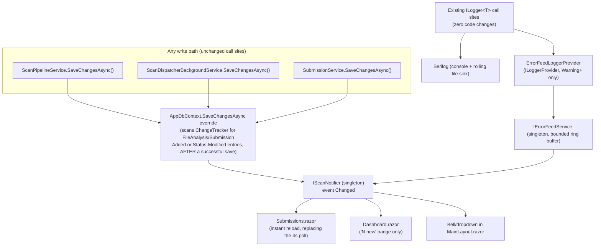

# Implementation Plan v3 — Remaining FR-12 Stand-outs + Icon Fix (Phases 9–11)

**Project:** Suspicious File Submission & VirusTotal Analysis Portal (.NET 10 / C#)
**Supersedes:** nothing — this is additive to `docs/implementation_plan_v2.md`, continuing its phase numbering from Phase 8.
**Hard constraints (same as v2):** no commits are made during execution — commit messages are supplied for the author to run; `DECISIONS.md` and `README.md` are not edited by the assistant — suggested content is provided for the author to apply.

## Context

Phases 1–8 are complete and verified: every MUST and SHOULD requirement in the brief (FR-01–11, VT-01–04, D-01–04) is implemented, tested (24 passing tests), documented (14-bullet `DECISIONS.md`), and pushed to a public GitHub repo. A full "what's left" review against the brief turned up exactly three open items, none of them required:

1. **FR-12 (COULD)** lists four stand-outs; only two are done (`.xlsx` export, the >32 MB strategy). **SignalR real-time updates** and **structured logging and error notifications** are not.
2. A cosmetic gap found during that review, not in the brief itself: **Bootstrap Icons was never vendored** — every `<i class="bi bi-*">` across the app (~19 distinct icon names) renders as blank space because only Bootstrap's CSS/JS were vendored, not its icon font.

This plan closes out all three, completing FR-12 and fixing the one visible rough edge, so the submission has nothing outstanding beyond intentionally-skipped optional work already logged in `DECISIONS.md` item 12.

## Decisions

- **Real-time transport:** an in-process pub/sub notifier riding Blazor Server's existing SignalR circuit — **not** a second, dedicated SignalR Hub. Blazor Server's render connection already is SignalR; opening a literal second Hub purely to name-check the technology would be a redundant transport for the same outcome.
- **Error notifications:** a live bell/dropdown in the header, not just "the Failed status already shows a reason." Concrete and demoable.
- **Dashboard liveness:** a subtle "N new" badge next to the existing manual Refresh button — the dashboard does **not** auto-re-run its aggregation query on every scan event (a 20-file burst would otherwise trigger 20 re-aggregations for a page FR-11 never asked to be live).

## Current state (verified via read-only exploration)

- **Submissions.razor** polls every 4s via a `PeriodicTimer` inside `RunAutoRefreshLoopAsync`, guarded by `_autoRefresh` and a `_dbLock` semaphore; skips ticks while the detail modal is open. `ReloadAsync` re-queries `GetSubmissionCountAsync` + `GetSubmissionsPageAsync`. This becomes the primary consumer of the new push events.
- **Dashboard.razor** has no polling at all today — `OnInitializedAsync` loads once, a manual Refresh button is the only way to update.
- **Every status transition** that matters is a `SaveChangesAsync()` call in `ScanPipelineService.cs` (7 sites: InProgress start, hash-cache-hit Completed, >32MB Completed, upload-stage transition, poll-completed Completed, poll-exhausted Failed) or `ScanDispatcherBackgroundService.cs` (startup reclaim, and the retry-exhausted Failed catch block) — 9 sites total. `SubmissionService.cs` creates new `FileAnalysis`/`Submission` rows in one `SaveChangesAsync` at the end of `SubmitFileAsync`.
- **Logging today** is plain `Microsoft.Extensions.Logging` via `ILogger<T>`, injected in 5 classes (`ScanPipelineService`, `ScanDispatcherBackgroundService`, `SubmissionService`, `VirusTotalClient`, plus `Home.razor`) and resolved manually in `DatabaseInitializer`. No Serilog, no custom provider, nothing in either `.csproj` beyond what `Microsoft.Extensions.Hosting.Abstractions` pulls in transitively.
- **Bootstrap** is vendored as static files under `wwwroot/lib/bootstrap/dist/{css,js}/`, referenced from `App.razor` via `@Assets["lib/bootstrap/dist/css/bootstrap.min.css"]`. No `libman.json` anywhere — this repo hand-vendors. No `bootstrap-icons` folder exists. ~19 distinct `bi-*` names are used across `Home.razor`, `Submissions.razor`, `Dashboard.razor`, `NavMenu.razor` (a small, fixed, enumerable set — not open-ended). `NavMenu.razor.css`'s 3 nav icons are separately hand-embedded inline SVGs and are unaffected either way.

## Architecture addition



The key move: **one choke point** (`AppDbContext.SaveChangesAsync`) replaces the need to touch 9 separate call sites, and the error feed is a plain `Microsoft.Extensions.Logging.ILoggerProvider` — decoupled from Serilog specifically, so it keeps working even if the logging backend ever changes.

---

## Phase 9 — Real-time push updates (FR-12: "SignalR")

**New files (`src/ElevateX.Core/Services/`):**
- `IScanNotifier.cs` — `ScanEvent(Guid FileAnalysisId, AnalysisStatus Status, bool IsNewSubmission)` record; `IScanNotifier` with `event Action<ScanEvent>? Changed` and `void Publish(ScanEvent)`; `ScanNotifier` singleton implementation (plain delegate event — `+=`/`-=` are thread-safe in .NET, and each subscriber is responsible for marshalling back to its own Blazor circuit via `InvokeAsync`, so the publisher never blocks on UI work).

**`AppDbContext.cs` changes:**
- Constructor gains an **optional** `IScanNotifier? notifier = null` parameter — keeps `TestSupport.NewDb`'s `new AppDbContext(options)` in the test project compiling unchanged; DI-resolved instances (the whole running app) get the real singleton automatically.
- Override `SaveChangesAsync(CancellationToken)`: before calling `base.SaveChangesAsync`, snapshot `ChangeTracker.Entries<FileAnalysis>()` where `State == Added` or (`State == Modified` and `Entry.Property(nameof(FileAnalysis.Status)).IsModified`), and `ChangeTracker.Entries<Submission>()` where `State == Added` — snapshotting *before* the save is required because EF clears these flags on success. Call `base.SaveChangesAsync` (must succeed first — no event fires on a failed/rolled-back save). Then publish one `ScanEvent` per snapshotted entry via `_notifier?.Publish(...)`.
- This is a **pure addition**: `ScanPipelineService`, `ScanDispatcherBackgroundService`, and `SubmissionService` are not touched at all.

**`Submissions.razor` changes:**
- Inject `IScanNotifier`. Subscribe in `OnInitializedAsync` (after the first `ReloadAsync`); unsubscribe in `DisposeAsync` alongside the existing cleanup.
- On `Changed`, coalesce bursts rather than firing one DB query per event: a `volatile bool _refreshPending` flag set by the handler, and a small loop guarded by the existing `_dbLock` (`WaitAsync(0)` — if a refresh is already in flight, just mark pending and let that in-flight pass pick up the latest state on its next loop iteration instead of queuing a second concurrent query). Only refresh when `_autoRefresh` is true and the detail modal isn't open, matching today's semantics.
- Keep the existing `PeriodicTimer` loop, but slow it from 4s to ~20–30s and reframe it as a resilience fallback (protects against a missed in-process event — relevant if this were ever scaled to multiple app instances, where in-process pub/sub wouldn't cross process boundaries). This is a one-line interval change, not a redesign.

**`Dashboard.razor` changes:**
- Inject `IScanNotifier`. Subscribe in `OnInitializedAsync`; on `Changed`, increment a `_newEventCount` field and `InvokeAsync(StateHasChanged)` — **do not** call `Analytics.GetSnapshotAsync()` again automatically. Show a small badge near the Refresh button (e.g. "3 new"); `LoadAsync` (already wired to the Refresh button) resets the counter to 0.
- Implement `IAsyncDisposable` to unsubscribe (currently the component has no `Dispose` at all).

**Program.cs:** `builder.Services.AddSingleton<IScanNotifier, ScanNotifier>();` alongside the other singletons.

**Compatibility constraint:** this phase must not require editing any file under `tests/` — the optional notifier parameter is what makes that true. Confirm with `dotnet test` after.

---

## Phase 10 — Structured logging & error notifications (FR-12)

**Packages (Portal project only — Core stays logging-framework-agnostic):** `Serilog.AspNetCore` (bundles hosting/logging/console integration) and `Serilog.Sinks.File`, added to `ElevateX.Portal.csproj`.

**New files (`src/ElevateX.Core/Services/`):**
- `IErrorFeedService.cs` — `ErrorFeedEntry(DateTimeOffset TimestampUtc, LogLevel Level, string Category, string Message)`; `IErrorFeedService` with `IReadOnlyList<ErrorFeedEntry> Recent`, `int UnreadCount`, `event Action<ErrorFeedEntry>? EntryAdded`, `void Record(ErrorFeedEntry)`, `void MarkAllRead()`. Implementation keeps a bounded buffer (cap ~50, drop oldest) so it can't grow unbounded over a long-running process.

**New files (`src/ElevateX.Portal/Logging/`):**
- `ErrorFeedLoggerProvider.cs` — implements `ILoggerProvider`; its `ILogger.IsEnabled` returns true only for `LogLevel.Warning` and above; `Log<TState>` builds an `ErrorFeedEntry` and calls `IErrorFeedService.Record`. Deliberately a plain `Microsoft.Extensions.Logging` provider, not a Serilog sink — it captures the same log calls regardless of which backend (Serilog or the default) is active.

**Program.cs changes:**
- Construct `var errorFeed = new ErrorFeedService();` before `builder.Build()`, register it as the `IErrorFeedService` singleton, and also `builder.Logging.AddProvider(new ErrorFeedLoggerProvider(errorFeed))` — constructing both directly sidesteps DI-container ordering, since a logger provider needs to exist before the host finishes building.
- `builder.Host.UseSerilog((context, services, cfg) => cfg.Enrich.FromLogContext().WriteTo.Console().WriteTo.File("logs/elevatex-.log", rollingInterval: RollingInterval.Day, retainedFileCountLimit: 14));` — code-configured, no new `appsettings.json` keys needed (keeps the README simpler).
- **No changes needed at any of the 5 existing `ILogger<T>` injection sites** — Serilog bridges `Microsoft.Extensions.Logging.ILogger<T>` transparently, so every existing `_logger.LogInformation(...)`/`LogWarning(...)`/`LogError(...)` call keeps working unchanged and now flows through both the new sinks and the error-feed provider.

**`MainLayout.razor` changes:**
- Add `@implements IAsyncDisposable`, inject `IErrorFeedService`, subscribe to `EntryAdded` in `OnInitialized` (marshal via `InvokeAsync(StateHasChanged)`), unsubscribe in `DisposeAsync`.
- Add a bell icon button in the existing top-row div (next to the current badges) showing `_feed.UnreadCount` as a small red badge when > 0; clicking opens a simple dropdown/panel listing `_feed.Recent` (timestamp, a level-colored badge, the message) with a "mark all read" action calling `MarkAllRead()`.

**`.gitignore`:** add `logs/` (rolling log files must not be committed, matching the existing pattern for `*.db*` and `uploads/`).

---

## Phase 11 — Bootstrap Icons (fixing the blank-glyph gap)

- Vendor the official MIT-licensed Bootstrap Icons static release (CSS + `.woff`/`.woff2` font files only — no npm, no libman, matching exactly how Bootstrap itself is already vendored) into `src/ElevateX.Portal/wwwroot/lib/bootstrap-icons/font/`.
- Add one line to `App.razor`, immediately after the existing `bootstrap.min.css` link: `<link rel="stylesheet" href="@Assets["lib/bootstrap-icons/font/bootstrap-icons.min.css"]" />`.
- **No other file changes.** Every `<i class="bi bi-*">` already in `Home.razor`, `Submissions.razor`, `Dashboard.razor`, and `NavMenu.razor` (~19 distinct icon names) starts rendering the instant the font/CSS exist — the markup was already written assuming this exact class convention. `NavMenu.razor.css`'s 3 separately hand-embedded SVG nav icons are untouched.

---

## Cross-cutting notes

- Ordering in `Program.cs`: register `IScanNotifier` and `IErrorFeedService` before `AddDbContext` (so `AppDbContext`'s optional notifier parameter resolves) and before `UseSerilog`/`AddProvider` (so the error feed exists when the logging provider is wired).
- `ScanEvent`/`ErrorFeedEntry` are plain records in `ElevateX.Core` — no dependency on Serilog or SignalR types anywhere in Core; only `ElevateX.Portal` takes the Serilog package reference and hosts the `ILoggerProvider`.
- None of this touches `ScanDispatcherBackgroundService`'s retry/rate-limit/quota logic, `ScanPipelineService`'s state machine, or `SubmissionService`'s dedup logic — Phases 4–8 remain unchanged and their 24 tests should pass without modification.

## Verification

1. `dotnet build ElevateX.slnx` — 0 warnings, 0 errors.
2. `dotnet test tests/ElevateX.Tests/ElevateX.Tests.csproj` — still 24/24, **no test file edited**.
3. `dotnet run --project src/ElevateX.Portal`, seed or submit a few files (placeholder key → fast-fail to `Failed` is fine for this): confirm the `/submissions` row updates within roughly a second of the DB write, not on the next 4s tick — compare a `Now.LogInformation` timestamp in the console to the UI update.
4. Confirm `/dashboard` shows a "N new" badge after those same events without re-querying `AnalyticsService` (check server logs / EF command logging for absence of the aggregation queries until Refresh is clicked).
5. Confirm the header bell's unread badge increments when a scan fails (the dispatcher's retry-exhausted path logs at `LogError`), the dropdown lists the entry, and `logs/elevatex-<date>.log` is created with structured entries.
6. Screenshot `/`, `/submissions`, `/dashboard`, and the nav sidebar before/after — every icon glyph should be visible (not blank space).
7. Fresh-clone smoke test (as done for Phase 4–8): clone, `dotnet run --project src/ElevateX.Portal` with no other setup — still just works.

## Suggested `DECISIONS.md` additions (author applies — continues from item 14)

```
15\. Centralized `AppDbContext.SaveChangesAsync` override — \*\*Real-Time Push Without Touching Business Logic\*\*

&#x20;   \* \*\*Why:\*\* Rather than adding a notify-call at each of the 9 separate `SaveChangesAsync` sites across the pipeline, dispatcher, and submission service, a single override on the DbContext detects Added/Modified `FileAnalysis` and `Submission` entries after a successful save and publishes one event per change. No existing service code changes, and no transition can be missed.

16\. In-process notifier over a dedicated SignalR Hub — \*\*"SignalR" Real-Time Updates (FR-12)\*\*

&#x20;   \* \*\*Why:\*\* Blazor Server's own render circuit already is a SignalR connection; a singleton pub/sub service publishes on it instead of opening a second, redundant transport just to name-check the technology literally. Submissions now updates within about a second of a status change instead of waiting up to 4s; a long fallback poll stays in place since in-process events wouldn't cross multiple app instances if this ever scaled out.

17\. Framework-agnostic `ILoggerProvider` error feed, Serilog for the sinks — \*\*Structured Logging \& Error Notifications (FR-12)\*\*

&#x20;   \* \*\*Why:\*\* A custom `ILoggerProvider` captures Warning-and-above entries into a bounded in-memory feed surfaced as a live bell/dropdown in the header — independent of which logging backend is active. Serilog supplies the structured console and rolling daily file output the brief asks for; every existing `ILogger&lt;T&gt;` call site needed zero changes since Serilog bridges `Microsoft.Extensions.Logging` transparently.

18\. Vendored Bootstrap Icons font/CSS, matching the existing Bootstrap vendoring — \*\*Fixing the Missing Icon Glyphs\*\*

&#x20;   \* \*\*Why:\*\* Roughly 19 `bi-*` icon names were already used across every page, but the icon font itself was never added, so they rendered as blank space. Vendoring the official static CSS+font files under `wwwroot/lib/bootstrap-icons/` — the same no-npm, no-libman pattern already used for Bootstrap itself — fixes every icon with one new `&lt;link&gt;` tag and zero markup changes.
```

## Suggested `README.md` additions (author applies)

- Under "What's in the app": note that Submissions now updates via an instant push (not a 4s poll), and mention the header notification bell for recent warnings/errors.
- New bullet: logs are written to `logs/` (gitignored) as structured, daily-rolling files, in addition to the console — no external log aggregator required, no new setup step.

## Commit checkpoints (author runs — no commits made during execution)

**Phase 9**
```
feat: push scan status changes live instead of polling every 4s

Co-Authored-By: Claude Sonnet 5 <noreply@anthropic.com>
```

**Phase 10**
```
feat: add structured logging (Serilog) and a live error-notification feed

Co-Authored-By: Claude Sonnet 5 <noreply@anthropic.com>
```

**Phase 11**
```
fix: vendor bootstrap icons font so bi-* glyphs actually render

Co-Authored-By: Claude Sonnet 5 <noreply@anthropic.com>
```
